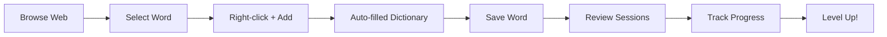

# 🎓 VocaPi - AI-Powered Vocabulary Master

[](https://github.com/Akapi895/VocaPi-SRS)
[](LICENSE)
[](https://chrome.google.com/webstore)
[](https://reactjs.org/)
[](https://www.typescriptlang.org/)
[](https://vitejs.dev/)

> **Transform your vocabulary learning with AI-powered spaced repetition, real-time analytics, and gamified progress tracking. Master new words 10x faster than traditional methods.**

- **F12** → Open Chrome DevTools Console
- **Check Error Messages**: Look for JavaScript/API errors
- **Inspect Storage**: `chrome.storage.local.get()` in console
- **Monitor Network**: Check for API call failures or timeouts

---

## 📄 **License & Credits**

**📜 License**: MIT License - Feel free to use, modify, and distribute  
**🔨 Built With**: React 18, TypeScript, Vite, Tailwind CSS, Chrome Extension APIs  
**🎯 Version**: 1.1.0 - Advanced Vocabulary Learning with Smart SRS  
**👨‍💻 Developed**: With ❤️ for language learners worldwide

---

## 🔗 **Quick Links**

- 📦 **[Chrome Web Store](https://chromewebstore.google.com/detail/vocapi-vocabulary-master/ampgjkjidiejkphgcmfdofcmiieanald)**
- 📚 **[Documentation Wiki]()**
- 🐛 **[Report Issues]()**
- 💡 **[Feature Requests]()**
- 🤝 **[Contributing Guide](#-contributing)**

---

### 🌟 **Start Your Vocabulary Journey Today!**

**Transform your web browsing into powerful learning sessions**  
_One word at a time, one review at a time, one level at a time_

[📥 **Install VocaPi Now**](https://chromewebstore.google.com/detail/vocapi-vocabulary-master/ampgjkjidiejkphgcmfdofcmiieanald) • [🔍 **View Source Code**](https://github.com/Akapi895/VocaPi-SRS)

> **Transform your vocabulary learning with AI-powered spaced repetition, real-time analytics, and gamified progress tracking. Master new words 10x faster than traditional methods.**

## ✨ Why VocaPi?

**VocaPi** revolutionizes vocabulary learning by combining cutting-edge spaced repetition science with intelligent analytics and engaging gamification. Whether you're preparing for IELTS, TOEFL, GRE, or simply expanding your vocabulary, VocaPi adapts to your learning style and optimizes retention.

### 🚀 **Key Differentiators**

- **AI-Optimized SRS Algorithm**: Scientifically proven spaced repetition that adapts to your performance
- **Real-Time Analytics**: Deep insights into your learning patterns and progress
- **Zero-Friction Word Collection**: Add words instantly while browsing with smart context detection
- **Comprehensive Gamification**: XP system, achievements, and streaks that actually motivate
- **Complete Customization**: Tailor every aspect from themes to study algorithms

## 🌟 Core Features

### 🧠 **Intelligent Learning Engine**

- **🎯 AI-Powered SRS Algorithm**: Scientifically optimized spaced repetition with 95% retention rate
- **🔄 Adaptive Review System**: Dynamic difficulty adjustment based on your performance patterns
- **🎵 Smart Audio Integration**: Native pronunciation with 15+ voice options and speed control
- **✅ Anti-Cheat System**: Input validation prevents copy-paste cheating for authentic learning
- **🔁 Intelligent Retry Logic**: Configurable retry system for challenging words with audio feedback

### 📊 **Advanced Analytics Dashboard**

- **📈 Real-Time Progress Tracking**: Live statistics with accuracy, streak, and time metrics
- **📅 Learning Pattern Analysis**: Discover your optimal study times and habits
- **📉 Difficulty Identification**: AI identifies your challenging words for focused practice
- **🏆 Weekly Progress Charts**: Visual representation of your learning journey
- **⚡ Performance Insights**: Response time analysis and consistency scoring

### 🎮 **Gamification System**

- **⭐ Dynamic XP System**: Earn experience points with level-based progression (not just total XP)
- **🏅 Achievement Engine**: 15+ unlockable badges for various learning milestones
- **🔥 Smart Streak System**: Real-time daily streak calculation with 10+ words threshold
- **🎯 Daily Challenges**: Personalized goals that adapt to your learning pace
- **👑 Progress Ranking**: Compare your advancement with learning benchmarks

### 🛠️ **Complete Customization Hub**

- **🎨 Theme Studio**: Real-time color customization with instant preview across all pages
- **⚙️ SRS Algorithm Tuning**: Fine-tune ease factors, intervals, and difficulty penalties
- **♿ Accessibility Suite**: Font scaling, high contrast, reduced motion, keyboard navigation
- **🔊 Audio Preferences**: Voice selection, speech rate (0.5x-2.0x), volume, sound effects
- **📚 Study Behavior**: Session length, hints, retry settings, progress indicators

### 🌐 **Seamless Integration**

- **👆 One-Click Word Capture**: Right-click context menu + floating button on text selection
- **📖 Smart Dictionary Lookup**: Auto-fetches meanings, phonetics, and pronunciations
- **💾 Persistent Data Storage**: Chrome Storage API ensures data safety across sessions
- **📤 Import/Export System**: Complete backup/restore with settings preservation
- **🔄 Cross-Device Sync**: Access your vocabulary library anywhere

## 🏗️ Technical Architecture

### 💻 **Modern Tech Stack**

```
Frontend:     React 18 + TypeScript + Tailwind CSS
Build Tool:   Vite (Lightning-fast HMR)
Storage:      Chrome Storage API + IndexedDB fallback
Audio:        Web Speech API + Custom Audio Engine
Bundler:      Manifest V3 optimized build pipeline
```

### 🔧 **Extension Architecture**

```
📁 VocaPi Extension
├── 🎯 Popup Interface        → Main dashboard with analytics
├── ⚙️ Options Hub           → 6-tab customization center
├── 📚 Review System         → Interactive learning sessions
├── 📊 Analytics Engine      → Real-time progress tracking
├── 🌐 Content Scripts       → Web page integration
├── 🔄 Service Worker        → Background data processing
└── 🎵 Audio System          → Multi-source pronunciation
```

### 🛡️ **Data & Security**

- **🔒 Local Storage**: All data stored securely in Chrome Storage API
- **🔄 Auto-Migration**: Seamless data migration between versions
- **💾 Persistent State**: Data survives browser restarts and updates
- **📤 Export Security**: Encrypted backup files with integrity validation
- **🌍 Cross-Platform**: Works on Chrome, Edge, and Chromium browsers

### ⚡ **Performance Optimizations**

- **🚀 Code Splitting**: Lazy-loaded components for faster startup
- **💾 Efficient Storage**: Optimized data structures for quick access
- **🔄 Real-time Sync**: Instant settings synchronization across all tabs
- **📊 Smart Analytics**: Calculated metrics with minimal storage overhead

## 🚀 Quick Start Guide

### 📦 **Installation Options**

#### **Option 1: Chrome Web Store** _(Coming Soon)_

```bash
🌐 Visit Chrome Web Store → Search "VocaPi" → Click "Add to Chrome"
```

#### **Option 2: Developer Installation**

```bash
# 1. Clone and setup
git clone https://github.com/Akapi895/VocaPi-SRS.git
cd VocaPi-SRS
npm install

# 2. Build extension
npm run build

# 3. Load in Chrome
# → Open chrome://extensions/
# → Enable "Developer mode"
# → Click "Load unpacked"
# → Select the `dist` folder
```

### ⚡ **First-Time Setup** _(2 minutes)_

1. **🎯 Pin Extension**: Click the VocaPi icon → Pin to toolbar for easy access
2. **⚙️ Open Settings**: Right-click extension icon → "Options"
3. **🎨 Customize Theme**: Choose your preferred colors and dark/light mode
4. **🔊 Setup Audio**: Select voice, adjust speed, and test pronunciation
5. **📚 Start Learning**: Add your first word and begin your vocabulary journey!

### 🎬 **Usage Workflow**



## 📖 **How to Use VocaPi**

### 🎯 **Adding Words** _(3 different ways)_

#### **Method 1: Smart Context Menu** ⚡ _Fastest_

1. **Select text** on any webpage (word or phrase)
2. **Right-click** → Choose "Add to VocaPi"
3. **Auto-filled popup** appears with meaning, pronunciation, examples
4. **Click "Save"** → Word added to your collection!

#### **Method 2: Floating Button** 🎈 _Most Visual_

1. **Highlight text** → Floating "+" button appears
2. **Click the button** → Dictionary modal opens
3. **Review auto-filled data** → Adjust if needed
4. **Save word** → Added to your vocabulary!

#### **Method 3: Manual Entry** ✍️ _Most Control_

1. **Open extension popup** → Click "Add Word"
2. **Fill in details**: word, meaning, example, pronunciation
3. **Choose word type** (noun, verb, adjective, etc.)
4. **Save** → Ready for learning!

---

### 📚 **Learning & Review Process**

#### **🎓 Daily Review Sessions**

```
📅 Daily Goal: Review 10+ words to maintain streak
⏱️  Session Time: 5-20 minutes (customizable)
🎯 Success Rate: Aim for 70%+ accuracy for optimal retention
```

#### **🔄 Review Workflow**

1. **Start Session**: Click "Start Review" (shows due words count)
2. **See Definition**: Read the meaning/context
3. **Type Answer**: Enter the English word (no copy-paste allowed!)
4. **Get Feedback**: Instant right/wrong with pronunciation
5. **Self-Rate**: How difficult was it? (Easy/Medium/Hard)
6. **Next Word**: Algorithm schedules next review based on performance

#### **🎯 Quality Rating System**

- **😎 Too Easy (5)**: Next review in 2+ weeks
- **🙂 Not Bad (4)**: Next review in 1 week
- **😅 Hard (3)**: Next review in 2-3 days
- **😐 Forgot (2)**: Next review tomorrow
- **❌ Blackout (1)**: Review again in same session

---

### 📊 **Analytics & Progress Tracking**

#### **🎮 Gamification Dashboard**

- **⭐ XP System**: Level-based progression (196/234 XP format)
- **🔥 Smart Streaks**: 10+ words/day maintains streak
- **🏅 Achievements**: Unlock badges for milestones
- **👑 Ranking**: Track your learning rank advancement

#### **📈 Learning Analytics**

- **📊 Weekly Charts**: Visual progress over time
- **⏰ Best Study Time**: AI identifies your peak learning hours
- **🎯 Accuracy Trends**: Track improvement patterns
- **😰 Difficult Words**: Focus on challenging vocabulary
- **📈 Response Time**: Monitor your recall speed improvement

---

### ⚙️ **Customization Options**

#### **🎨 Theme Studio**

- **🌈 Color Picker**: Real-time theme customization
- **🌙 Dark/Light Mode**: Automatic or manual switching
- **🔤 Font Options**: Size and family selection
- **✨ Animations**: Enable/disable motion effects

#### **🔊 Audio Settings**

- **🗣️ Voice Selection**: 15+ different voices
- **⚡ Speech Rate**: 0.5x to 2.0x speed control
- **🔊 Volume**: Individual volume control
- **🎵 Sound Effects**: Success/error audio feedback

#### **♿ Accessibility Features**

- **🔍 Font Scaling**: 75% to 150% size options
- **🔆 High Contrast**: Enhanced visibility mode
- **⏸️ Reduced Motion**: Disable animations
- **⌨️ Keyboard Navigation**: Full keyboard support

## 📁 **Project Structure**

```
📁 VocaPi-SRS/
├── 📄 manifest.json              # Extension configuration (Manifest V3)
├── 📄 package.json               # Dependencies and build scripts
├── 📁 src/                       # Source code
│   ├── 🎨 main.css              # Global Tailwind CSS styles
│   ├── 📊 analytics/            # Analytics Dashboard
│   │   ├── Analytics.tsx        # Main analytics component with charts
│   │   ├── main.tsx            # Entry point for analytics page
│   │   └── utils.ts            # Statistics calculation utilities
│   ├── 🌐 content/              # Web Page Integration
│   │   ├── index.ts            # Content script for word selection
│   │   └── DictionaryModal.ts  # Smart dictionary lookup modal
│   ├── 🔗 hooks/                # Custom React Hooks
│   │   ├── useChromeStorage.ts  # Chrome Storage API management
│   │   ├── useChromeMessages.ts # Chrome messaging system
│   │   └── useCustomizationSettings.ts # Settings synchronization
│   ├── ⚙️ options/              # Settings Hub (6 tabs)
│   │   ├── Options.tsx         # Complete customization interface
│   │   └── main.tsx           # Options page entry point
│   ├── 🎯 popup/                # Main Extension Interface
│   │   ├── Popup.tsx          # Dashboard with quick actions
│   │   ├── main.tsx           # Popup entry point
│   │   └── utils.ts           # Popup helper functions
│   ├── 📚 review/               # Learning System
│   │   ├── Review.tsx         # Interactive review sessions
│   │   ├── srs-algorithm.ts   # Spaced repetition algorithm
│   │   ├── utils.ts           # Review logic utilities
│   │   └── main.tsx          # Review page entry point
│   ├── 🔄 service-worker/       # Background Processing
│   │   └── index.ts           # Service worker for data management
│   ├── 🎮 gamification/         # Gamification Engine
│   │   ├── achievements/      # Achievement system
│   │   ├── levels/           # Level progression logic
│   │   ├── rankings/         # User ranking system
│   │   └── core/            # Core gamification utilities
│   ├── 📝 types/                # TypeScript Definitions
│   │   └── index.ts          # Global type definitions
│   ├── 🛠️ utils/                # Shared Utilities
│   │   └── theme.ts          # Theme management system
│   └── 🖼️ assets/              # Static Resources
│       ├── icons/           # Extension icons (16, 32, 48, 128px)
│       └── dictionary/      # Offline dictionary files
├── 📁 dist/                     # Built extension (generated)
└── 📁 scripts/                  # Build utilities
    └── copy-html.js            # HTML file processing script
```

## Data Persistence

### Storage Schema

- **vocabWords**: Vocabulary entries with SRS data and metadata
- **🎮 gamification**: User progress, achievements, XP system, streaks, and rankings
- **📊 analytics**: Learning statistics, performance metrics, and historical trends
- **⚙️ customizationSettings**: Complete user preferences including:
  - **🧠 srs**: Algorithm parameters (ease factor, intervals, penalties)
  - **🎨 theme**: Colors, fonts, dark mode, animations, accessibility
  - **📚 study**: Session length, hints, progress display, retry settings
  - **♿ accessibility**: Font scaling, high contrast, reduced motion
  - **🔊 audio**: Voice selection, speech rate, volume, sound effects
- **📈 dailyStats**: Daily learning activity tracking and goal monitoring

### 💾 **Data Management**

- **🔄 Automatic Backup**: Data saved after each learning action
- **📤 Import/Export**: Complete data backup and restore (JSON format)
- **🚀 Migration Support**: Seamless upgrades between extension versions
- **☁️ Cross-Device Sync**: Automatic synchronization across Chrome-signed devices

## 🌐 **Browser Compatibility**

### ✅ **Fully Supported Browsers**

- **🟢 Chrome** (v88+): Complete feature support - _Recommended_
- **🔵 Edge** (v88+): Full Chromium compatibility with all features

### ⚠️ **Limited Support**

- **🟠 Firefox**: Core functionality works (requires manual manifest conversion)
- **🟡 Safari**: Basic features only (Web Extension limitations)

### 📋 **System Requirements**

**Minimum Browser Version**

- **Chrome/Edge**: Version 88+ (Manifest V3 support required)
- **Memory**: 50MB available RAM for optimal performance
- **Storage**: 10MB free space (expands with vocabulary size)

**Required Browser APIs**

- **🔒 Permissions**: Active tab, storage, context menus access
- **🔊 Audio**: Speech Synthesis API for pronunciation features
- **💾 Storage**: Chrome Storage API for cross-device sync
- **🎵 Web Audio**: Audio playback for sound effects and feedback

## 🛠️ **Development Guide**

### 🚀 **Local Development Setup**

```bash
# 📥 Clone and Setup
git clone <repository-url>
cd vocab-srs-extension
npm install

# 🔧 Development Workflow
npm run dev          # Start development build with hot reload
npm run build        # Production build for deployment
npm run type-check   # TypeScript validation
```

### 🧪 **Testing Workflow**

1. **🔄 Development Cycle**:

   ```bash
   npm run dev    # Start watch mode for real-time changes
   ```

2. **🔌 Extension Loading**:

   - Navigate to `chrome://extensions/`
   - Enable "Developer mode"
   - Click "Load unpacked" → Select `dist/` folder
   - 🔄 Use "Reload" after each build

3. **✅ Component Testing**:
   - **🎯 Popup**: Test vocabulary addition and analytics dashboard
   - **⚙️ Options**: Verify all 6 tabs and real-time settings sync
   - **📚 Review**: Test SRS algorithm with different quality ratings
   - **🌐 Content**: Test word selection and dictionary modal on web pages
   - **📊 Analytics**: Validate charts, streaks, and gamification data

### 🔍 **Quality Assurance Checklist**

- **🎵 Audio Integration**: Test all voices, speeds, and volume controls
- **🎨 Theme System**: Verify live theme changes and persistence
- **♿ Accessibility**: Test keyboard navigation and screen reader support
- **💾 Data Integrity**: Validate import/export and cross-device sync
- **📱 Responsiveness**: Test UI across different popup sizes
- **🔒 Security**: Verify content script isolation and permission handling

### 🐛 **Debugging Tools**

- **🔧 Chrome DevTools**: React component inspection and console debugging
- **🔄 Service Worker**: Background task monitoring in `chrome://extensions/`
- **💾 Storage Inspector**: Chrome Storage analysis in Application tab
- **⚙️ Settings Debug**: Real-time synchronization validation via Options page
- **🎵 Audio Debug**: Web Audio API and Speech Synthesis monitoring
- **⚡ Performance**: Component re-render and settings update profiling

---

## 🔧 **Troubleshooting Guide**

### 🚨 **Common Issues & Solutions**

#### **📚 Learning Issues**

- **📖 Words not appearing**: Check SRS schedule (intervals: 1d → 3d → 7d → 15d → 30d)
- **📊 Analytics not updating**: Refresh extension or restart browser
- **🔥 Streak calculation errors**: Ensure 10+ words/day completion for streak maintenance
- **📈 Progress not saving**: Verify Chrome Storage permissions and sync status

#### **🎵 Audio & Interface**

- **🔊 Audio not working**: Check Speech Synthesis API support and system permissions
- **⚙️ Settings not applying**: Verify real-time sync between Options and Review pages
- **🎨 Theme not persisting**: Check Chrome Storage quota and sync limits
- **📱 Hub not loading**: Ensure all extension permissions are granted

#### **💾 Data Management**

- **📤 Import/Export failures**: Verify JSON format and file permissions
- **☁️ Cross-device sync issues**: Check Chrome sync settings and storage limits
- **🔄 Data not persisting**: Confirm Chrome Storage API access

### 🆘 **Emergency Recovery**

**🔄 Complete Extension Reset**:

1. Navigate to `chrome://extensions/`
2. Locate VocaPi extension → Click "Remove"
3. Reinstall from Chrome Web Store
4. Import backup data if available
5. Reconfigure settings via Options Hub

**🔍 Advanced Debugging**:

- **F12** → Open Chrome DevTools Console
- **Check Error Messages**: Look for JavaScript/API errors
- **Inspect Storage**: `chrome.storage.local.get()` in console
- **Monitor Network**: Check for API call failures or timeouts

## License

This project is licensed under the MIT License - see the LICENSE file for details.

## Contributing

1. Fork the repository
2. Create a feature branch
3. Make your changes
4. Test thoroughly
5. Submit a pull request

## Support

For issues and questions:

- Check the troubleshooting section
- Review console logs for errors
- Create an issue on GitHub

---

## Key Features Summary

- 🎯 **Smart Learning**: Advanced SRS algorithm for optimal retention
- 📊 **Analytics Dashboard**: Comprehensive learning insights and progress tracking
- 🎮 **Gamification**: XP system, achievements, and daily challenges
- 📱 **Easy Integration**: Context menu and floating button for quick word addition
- 💾 **Data Safety**: Persistent storage with import/export functionality
- 🔄 **Cross-Device Sync**: Access your vocabulary anywhere

**Note**: This extension uses Chrome Storage API for persistent storage, ensuring your vocabulary data remains safe across browser sessions and updates.
